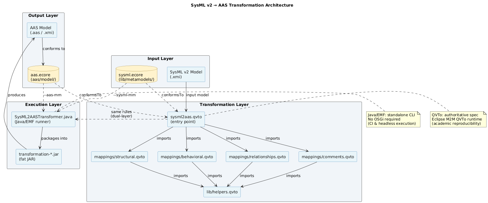

# Transformation Architecture

This document describes the layered architecture of the SysML v2 → AAS transformation pipeline.



---

## Overview

The pipeline takes a **SysML v2 model** (serialised as XMI) and produces an **Asset Administration Shell (AAS) model** (serialised as XMI conforming to IEC 63278 / Part 1). The transformation is governed by two metamodels — `sysml.ecore` for the source language and `aas.ecore` for the target language — and is implemented in two complementary layers.

---

## Layer Descriptions

### Input Layer

| Artefact | Path | Role |
|----------|------|------|
| SysML v2 model (`.xmi`) | provided by the user | Source model conforming to `sysml.ecore` |
| `sysml.ecore` | `lib/metamodels/sysml.ecore` | SysML v2 metamodel (vendored from Systems-Modeling/SysML-v2-Pilot-Implementation, LGPL-3.0) |

The SysML v2 XMI must be generated from a textual `.sysml` file using the SysML v2 Pilot Implementation parser (Eclipse-based). The vendored `sysml.ecore` is used by both the QVTo runtime and the Java runner for dynamic loading.

### Transformation Layer (QVTo)

The authoritative specification of the mapping rules lives in the QVTo scripts:

| File | Role |
|------|------|
| `transformation/sysml2aas.qvto` | Entry point; `main()` drives the top-level traversal |
| `transformation/mappings/structural.qvto` | Table 1 rules: Package→Shell, Element→Entity, Attribute→Property |
| `transformation/mappings/behavioral.qvto` | Table 2 rules: Action→Operation, State→SubmodelElementCollection |
| `transformation/mappings/relationships.qvto` | Table 3 rules: FeatureMembership→RelationshipElement |
| `transformation/mappings/comments.qvto` | Comment/Documentation→Extension/File |
| `transformation/lib/helpers.qvto` | Shared navigation queries (`ownedPackages()`, `ownedMembers()`, etc.) |

QVTo scripts are executed inside Eclipse via the Eclipse M2M QVTo runtime (requires Eclipse Modeling Tools ≥ 2023-09 with MDT QVTo). They serve as the academically reproducible specification of the mapping.

### Execution Layer (Java/EMF)

For standalone CLI execution and CI, the same rules are implemented via the EMF reflective API:

| Artefact | Path | Role |
|----------|------|------|
| `SysML2AASTransformer.java` | `transformation/src/main/java/…` | Implements mapping rules using EMF `eGet`/`eClass` API |
| `RunTransformation.java` | `transformation/src/main/java/…` | CLI entry point; accepts `--input`, `--output`, `--sysml-mm`, `--aas-mm` |
| Fat JAR | `transformation/target/transformation-1.0-SNAPSHOT-jar-with-dependencies.jar` | Self-contained executable; produced by `mvn package` |

The Java runner loads `sysml.ecore` dynamically at runtime — no SysML code generation is required. It is the layer used by `examples/run-all.sh` in CI.

### Output Layer

| Artefact | Role |
|----------|------|
| AAS model (`.aas` / `.xmi`) | Target model conforming to `aas.ecore` |
| `aas/model/aas.ecore` | AAS metamodel defined in this repository (IEC 63278 / Part 1 subset) |

---

## Dual-Layer Design Rationale

The QVTo layer and Java layer implement the same rules but serve different purposes:

- **QVTo**: machine-readable specification, directly cross-referenced in `docs/mapping-tables.md`, executable by any Eclipse M2M QVTo installation.
- **Java/EMF**: headless, Maven-buildable, CI-compatible. No Eclipse runtime or OSGi container required.

When the AAS metamodel changes (via Eclipse EMF regeneration), both layers must be updated in sync. See `docs/DESIGN-AND-PLAN.md` D-003 for the full rationale.

---

## Regenerating the Architecture Diagram

The diagram source is `docs/architecture.puml` (PlantUML). To re-render `architecture.png`:

```powershell
# Requires a local Kroki instance at localhost:8084
$puml = Get-Content docs\architecture.puml -Raw
Invoke-RestMethod -Method Post -Uri http://localhost:8084/plantuml/png `
  -Body $puml -ContentType "text/plain" -OutFile docs\architecture.png
```

Or use the [Kroki online service](https://kroki.io) (paste the contents of `architecture.puml`).
